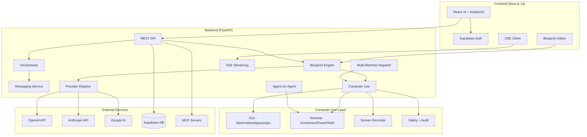

# AgentForge

**Agentic AI orchestration platform — design workflows visually, automate GUIs and terminals, and coordinate agents across machines.**

Build AI-powered workflows that chain LLM reasoning with deterministic logic, automate any desktop or terminal, and orchestrate multiple agents in parallel. Visual DAG editor with 44 node types, cross-platform computer use, multi-model provider support, and real-time execution streaming. Runs fully local with SQLite (zero external accounts) or scales to cloud with Supabase.


---

## Features

### Visual Blueprint System
Drag-and-drop DAG workflow builder with 44 node types across 9 categories. Topological execution engine with concurrent layer resolution, context assembly with token budgets, retry policies, and SSE-streamed execution traces.

### Computer Use (GUI + Terminal)
Agents operate machines through GUI automation and terminal orchestration across macOS, Linux, and Windows:

| Capability | Nodes | What It Does |
|-----------|-------|-------------|
| **GUI (Steer)** | 12 | Screenshot, OCR, click, type, hotkey, scroll, drag, focus, find, wait, clipboard, app listing |
| **Terminal (Drive)** | 6 | Session management, command execution, key sending, log capture, polling, parallel fanout |
| **CU Agents** | 4 | LLM-powered Planner, Analyzer, Verifier, Error Handler |
| **Screen Recording** | 1 | Record sessions via CoreGraphics + ffmpeg (works over SSH) |
| **Safety** | — | App/command blocklist, rate limiting, approval gates, audit logging |

### Cross-Platform Support

| Platform | GUI Automation | Terminal | Method |
|----------|---------------|----------|--------|
| macOS | Native Steer CLI (CoreGraphics, cliclick, Vision OCR) | Drive CLI / tmux | Works over SSH |
| Linux | xdotool, scrot, tesseract, wmctrl, xclip | tmux | Xvfb for headless |
| Windows | pyautogui, pytesseract, pygetwindow | PowerShell + WSL/tmux | Python packages |

### Agent-on-Agent Orchestration
Spawn and control external coding agents (Claude Code, Codex CLI, Gemini CLI, Aider) as workers in tmux sessions. Full lifecycle management with 6 agent control blueprint nodes.

### Multi-Machine Dispatch
Route blueprint nodes to different execution targets. Dispatch routing: explicit target → blueprint default → capability-based → local fallback.

### Multi-Model Providers
Provider registry supporting OpenAI, Anthropic, and Google. Per-node model selection, health monitoring, and comparison tools.

### Knowledge Base + RAG
Document collections with chunked upload, semantic search, and a `knowledge_retrieval` blueprint node for RAG-augmented workflows.

### Eval Framework
Test agent outputs with grading methods: exact_match, contains, json_schema, screenshot_match, ocr_contains. Multi-model comparison and per-prompt-version evaluation.

### Human-in-the-Loop
`approval_gate` blueprint node pauses execution for human review. Approve/reject with inbox UI and CLI.

### MCP Integration
Model Context Protocol connection management. Agents dynamically discover and use tools from connected MCP servers.

### Observability + Prompt Versioning
Distributed trace recording for all executions. Version prompts like code — diff, rollback, and measure how changes affect output quality.

### Workflow Marketplace
Publish, browse, fork, and rate blueprints. Organization support with member RBAC.

### Live Dashboard + CLI
Real-time monitoring with heartbeat tracking, SSE-powered updates, cost analytics. CLI-first experience with 35+ command groups covering the full platform — no browser required.

---

## Node Types (44)

| Category | Count | Nodes |
|----------|-------|-------|
| Context | 3 | fetch_url, fetch_document, knowledge_retrieval |
| Transform | 2 | text_splitter, template_renderer |
| Validate | 3 | json_validator, run_linter, approval_gate |
| Output | 2 | output_formatter, chunker |
| Agent (LLM) | 5 | llm_summarize, llm_extract, llm_generate, llm_review, llm_classify |
| GUI (Steer) | 13 | steer_see, steer_ocr, steer_click, steer_type, steer_hotkey, steer_scroll, steer_drag, steer_focus, steer_find, steer_wait, steer_clipboard, steer_apps, recording_control |
| Terminal (Drive) | 6 | drive_session, drive_run, drive_send, drive_logs, drive_poll, drive_fanout |
| CU Agent | 4 | cu_planner, cu_analyzer, cu_verifier, cu_error_handler |
| Agent Control | 6 | agent_spawn, agent_prompt, agent_monitor, agent_wait, agent_stop, agent_result |

---

## Architecture



---

## Tech Stack

| Layer | Technology |
|-------|-----------|
| Frontend | Next.js 14, TypeScript, Tailwind CSS, shadcn/ui, React Flow, Bun |
| Backend | Python 3.12, FastAPI, LangChain, OpenAI/Anthropic/Google APIs |
| Computer Use | CoreGraphics, cliclick, Vision OCR, ffmpeg, tmux, xdotool, pyautogui |
| CLI | Typer, Rich, httpx |
| Database | SQLite (default, zero config) or PostgreSQL via Supabase |
| Auth | Local JWT (default) or Supabase Auth (email + GitHub OAuth) |
| Testing | pytest (620 tests), vitest + testing-library (21 tests) |
| Deployment | Vercel (frontend), Render (backend) |
| CI/CD | GitHub Actions (Ruff, mypy, pytest, ESLint, tsc, vitest) |

---

## Quick Start

```bash
# Clone and setup
git clone https://github.com/AaronCx/AgentForge.git
cd AgentForge
./setup.sh

# Add an LLM provider key
edit backend/.env              # Add OpenAI, Anthropic, or use Ollama for local models

# Start everything
agentforge up

# Open the dashboard
agentforge dashboard           # Terminal TUI
# or visit http://localhost:3000  # Web GUI
```

Three steps. No database accounts. No migration steps. SQLite is created automatically.

### Prerequisites

- Python 3.11+ (backend + CLI)
- [Bun](https://bun.sh) or Node.js (frontend)
- At least one LLM provider: OpenAI, Anthropic, Google, or a local model via [Ollama](https://ollama.com)

No Supabase account needed for local use — the database (SQLite) and auth (local JWT) are built-in.

### Computer Use (macOS)

```bash
./scripts/bootstrap-macos.sh      # Installs deps, builds native CLIs, checks permissions
./scripts/bootstrap-verify.sh     # Smoke tests all 20 Steer + Drive commands
```

<details>
<summary>Linux / Windows setup</summary>

```bash
# Linux
sudo apt install xdotool scrot tesseract-ocr wmctrl xclip tmux xvfb

# Windows
pip install pyautogui pytesseract pygetwindow pyperclip
```

</details>

### Docker

```bash
cp backend/.env.example .env
docker-compose up --build
```

### Stack Management

```bash
agentforge up          # Start backend + frontend
agentforge down        # Stop everything
agentforge restart     # Restart all services
agentforge status      # Quick health check
agentforge dashboard   # Live TUI monitor
```

---

## Deployment Options

### Local (recommended for personal use)
- **Database:** SQLite (zero config, auto-created)
- **Auth:** Local JWT (auto-configured)
- **Setup:** `./setup.sh && agentforge up`
- **External accounts:** None required

### Docker (self-hosted)
- **Database:** SQLite in mounted volume
- **Auth:** Local JWT
- **Setup:** `docker-compose up`

### Cloud (team deployment)
- **Database:** Supabase PostgreSQL
- **Auth:** Supabase Auth (email + GitHub OAuth)
- **Setup:** Create Supabase project, configure keys, deploy to Vercel + Render

### Showcase (agentforge.vercel.app)
- Demo mode with simulated data
- Optional BYOK for live LLM calls
- No account required

---

## Environment Variables

### Backend (`backend/.env`)

| Variable | Description |
|----------|-------------|
| `OPENAI_API_KEY` | OpenAI API key (optional — use any provider) |
| `ANTHROPIC_API_KEY` | Anthropic API key (optional) |
| `GOOGLE_API_KEY` | Google AI API key (optional) |
| `OLLAMA_BASE_URL` | Ollama endpoint for local models (optional) |
| `SERPAPI_KEY` | SerpAPI key for web search tool (optional) |
| `FRONTEND_URL` | Frontend URL for CORS |
| `CU_DRY_RUN` | `true` for computer use dry-run mode |
| `SUPABASE_URL` | Supabase project URL (only for cloud mode) |
| `SUPABASE_SERVICE_KEY` | Supabase service role key (only for cloud mode) |

For local mode: only LLM provider keys needed. Database and auth are automatic.

### Frontend (`frontend/.env.local`)

| Variable | Description |
|----------|-------------|
| `NEXT_PUBLIC_API_URL` | Backend API URL (required) |
| `NEXT_PUBLIC_SUPABASE_URL` | Supabase project URL (cloud mode only) |
| `NEXT_PUBLIC_SUPABASE_ANON_KEY` | Supabase anonymous key (cloud mode only) |

---

## API

### Authentication

```
Authorization: Bearer <supabase-access-token>
```

### Core

| Method | Path | Description |
|--------|------|-------------|
| `GET` | `/api/agents` | List agents |
| `POST` | `/api/agents` | Create agent |
| `POST` | `/api/agents/:id/run` | Run agent (SSE) |
| `GET` | `/api/blueprints` | List blueprints |
| `POST` | `/api/blueprints` | Create blueprint |
| `POST` | `/api/blueprints/:id/run` | Run blueprint (SSE) |
| `GET` | `/api/blueprints/node-types` | List all 44 node types |
| `POST` | `/api/orchestrate` | Start orchestration (SSE) |

### Computer Use

| Method | Path | Description |
|--------|------|-------------|
| `GET` | `/api/computer-use/status` | Capability report |
| `GET` | `/api/computer-use/config` | Configuration |
| `POST` | `/api/computer-use/refresh` | Refresh capabilities |
| `GET` | `/api/computer-use/audit-log` | Audit log |

### Additional APIs

Runs, Costs, Dashboard, Messages, Orchestration, Providers, Evals, Approvals, Traces, Prompts, Knowledge, Marketplace, Organizations, MCP, Triggers, Targets, API Keys

---

## CLI

The CLI covers every action available in the web UI. A user who never opens a browser can set up, configure, create agents, build blueprints, run workflows, check costs, manage knowledge bases, run evals, and monitor everything from the terminal.

```bash
# Setup & lifecycle
agentforge init                             # Create ~/.agentforge/config.toml
agentforge up                               # Start backend + frontend
agentforge down                             # Stop everything
agentforge restart                          # Restart all services
agentforge status                           # Quick health check
agentforge health                           # Detailed system health
agentforge dashboard                        # Live TUI dashboard

# Auth
agentforge auth signup --email e --password p   # Create account from CLI
agentforge auth login --email e --password p    # Login, store token
agentforge auth logout                          # Clear session
agentforge auth whoami                          # Current user info

# Configuration
agentforge config show                      # Display config (keys masked)
agentforge config set api-key <key>         # Set a config value
agentforge config set-provider openai <key> # Configure provider (updates .env too)
agentforge config set-default-model gpt-4o  # Set default model

# Agents
agentforge agents list                      # List agents
agentforge agents create --name "X" --prompt "..." --tools web_search
agentforge agents run <id> --input "..."    # Run with streaming output
agentforge agents history <id>              # Run history for an agent
agentforge agents templates                 # List available templates

# Blueprints
agentforge blueprints list                  # List blueprints
agentforge blueprints create --from-template research
agentforge blueprints run <id> --input "..."# Run with node-by-node streaming
agentforge blueprints export <id> -o bp.json# Export as JSON for version control
agentforge blueprints import bp.json        # Import from JSON

# Multi-agent orchestration
agentforge orchestrate "objective text"     # Submit and stream

# Cost tracking
agentforge costs                            # Summary (today/week/month)
agentforge costs --breakdown agent          # By agent, model, or provider
agentforge costs --period month             # Monthly view

# Models & providers
agentforge models list                      # All models across providers
agentforge models test anthropic            # Test provider connection
agentforge models compare --prompt "..." --models "gpt-4o,claude-sonnet-4-20250514"

# Evals
agentforge evals create --name "Quality" --target agent:<id>
agentforge evals add-case <suite> --input "X" --expected "Y"
agentforge evals run <suite-id>             # Run eval suite
agentforge evals results <run-id>           # Detailed results

# Knowledge base
agentforge knowledge create --name "Docs"
agentforge knowledge upload <kb-id> ./docs/ # Upload directory
agentforge knowledge search <kb-id> --query "text"

# Computer use
agentforge cu status                        # Capability report
agentforge cu see                           # Take screenshot
agentforge cu ocr                           # OCR screen text
agentforge cu click 500 300                 # Click at coordinates
agentforge cu type "hello"                  # Type text
agentforge cu focus Safari                  # Focus app
agentforge cu find "Button Label"           # Find element by text

# Additional command groups
agentforge runs list                        # View agent runs
agentforge triggers list                    # Manage event triggers
agentforge approvals list                   # Human-in-the-loop inbox
agentforge traces list                      # Execution traces
agentforge prompts list <agent-id>          # Prompt versioning
agentforge marketplace browse               # Browse blueprints
agentforge mcp list                         # MCP connections
agentforge targets list                     # Execution targets
agentforge recordings list                  # Screen recordings
agentforge keys list                        # API key management
```

---

## Testing

```bash
# Backend (620 tests)
cd backend && source .venv/bin/activate
pytest tests/ -v --cov=app

# Frontend (21 tests)
cd frontend && npx vitest run

# Or use the Makefile
make test
```

---

## Project Structure

```
AgentForge/
├── frontend/                    # Next.js 14 + TypeScript + Tailwind + shadcn/ui
│   ├── app/dashboard/           # 15+ dashboard routes
│   ├── components/              # Blueprint editor, dashboard, UI primitives
│   └── lib/                     # API client, auth client, demo data
├── backend/                     # FastAPI + LangChain
│   ├── app/
│   │   ├── db/                  # Pluggable database layer (SQLite + Supabase)
│   │   ├── routers/             # 22 API route modules (incl. auth API)
│   │   ├── providers/           # Multi-model provider registry
│   │   └── services/
│   │       ├── blueprint_nodes/ # 44 node type executors
│   │       └── computer_use/    # Steer, Drive, agents, dispatch, recorder
│   │           ├── steer/       # macOS GUI automation
│   │           ├── drive/       # Terminal automation
│   │           ├── linux/       # xdotool/tesseract fallback
│   │           └── windows/     # pyautogui/PowerShell fallback
│   └── tests/                   # 620 tests
├── cli/                         # Typer + Rich CLI (35+ command groups)
├── scripts/                     # Bootstrap, Steer/Drive CLIs, OCR helper
├── supabase/migrations/         # 17 SQL migrations (cloud mode only)
├── setup.sh                     # One-command project setup
├── Makefile                     # setup, up, down, test, lint targets
├── docs/                        # Test & security reports
└── .github/workflows/           # CI + deployment
```

---

## License

MIT
