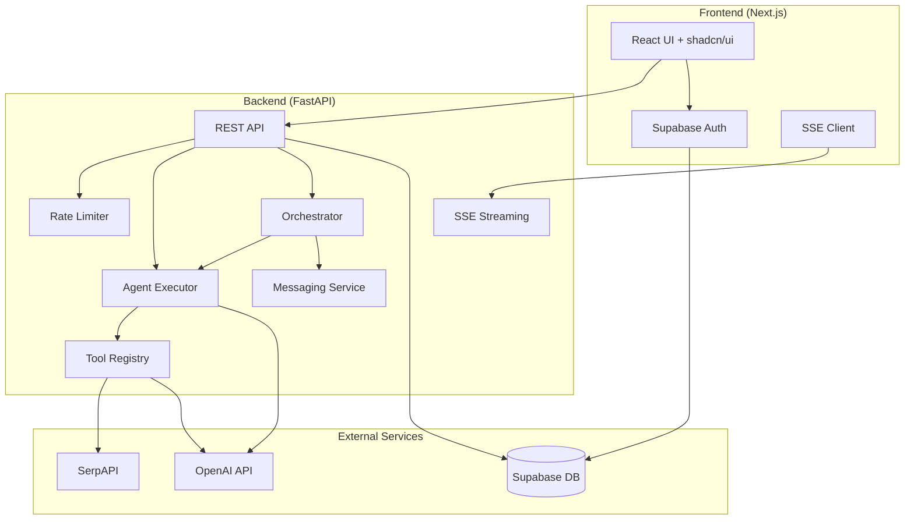

# AgentForge

**Multi-agent AI workflow platform — build, orchestrate, and monitor AI agents with tool use.**

Build custom AI agents that chain LLM calls, search the web, parse documents, extract structured data, execute code, and automate repetitive tasks. Orchestrate multi-agent objectives with dependency graphs and real-time monitoring.


---

## Features

### Agent Builder
Create custom agents with a name, system prompt, tool selection, and multi-step workflow definitions. Agents can chain together multiple LLM calls with accumulated context.

### Agent Runner
Execute agents with text input or file uploads. Real-time SSE streaming shows step-by-step execution with output appearing as it's generated.

### Multi-Agent Orchestration
Submit high-level objectives and let agents decompose tasks, respect dependency graphs, and execute concurrently. Roles include coordinator, supervisor, worker, scout, and reviewer.

### Live Monitoring Dashboard
Real-time dashboard with agent heartbeat tracking, SSE-powered updates, stalled agent detection (30s threshold), and event timeline with severity filtering.

### Inter-Agent Messaging
Agents communicate via typed messages (info, request, response, error, handoff) within task groups. View message feeds with type filtering and bilateral conversation history.

### Cost Analytics
Track token usage per agent, model, and run. Get daily/weekly/monthly summaries, breakdown reports by agent or model, per-run step-by-step usage, and monthly cost projections.

### CLI
Full command-line interface with live TUI dashboard, agent management, orchestration, message viewing, and cost analysis.

### Pre-built Templates

| Agent | Description | Tools Used |
|-------|-------------|------------|
| **Document Analyzer** | Upload a PDF/DOCX → structured summary, entities, action items | document_reader, data_extractor, summarizer |
| **Research Agent** | Topic → web search, synthesis, structured report | web_search, summarizer |
| **Data Extractor** | Unstructured text → clean JSON with entities and relationships | data_extractor |
| **Code Reviewer** | Code → bug, security, and performance review with severity ratings | code_executor |

### Tools Library

| Tool | Description |
|------|-------------|
| `web_search` | Search the web via SerpAPI |
| `document_reader` | Extract text from PDF/DOCX files |
| `code_executor` | Run Python in a sandboxed environment |
| `data_extractor` | Extract structured JSON from text |
| `summarizer` | Condense long documents |

---

## Architecture



---

## Tech Stack

| Layer | Technology |
|-------|-----------|
| Frontend | Next.js 14, TypeScript, Tailwind CSS, shadcn/ui, Bun |
| Backend | Python 3.12, FastAPI, LangChain, OpenAI API |
| CLI | Typer, Rich, httpx |
| Database | PostgreSQL via Supabase |
| Auth | Supabase Auth (email + GitHub OAuth) |
| Testing | pytest + pytest-asyncio (backend), vitest + testing-library (frontend) |
| Deployment | Vercel (frontend) + Render (backend) |
| CI/CD | GitHub Actions |

---

## Setup

### Prerequisites

- [Bun](https://bun.sh) (frontend package manager and build tool)
- Python 3.12+
- Supabase project ([create one](https://supabase.com))
- OpenAI API key

### 1. Clone the repository

```bash
git clone https://github.com/AaronCx/AgentForge.git
cd AgentForge
```

### 2. Set up the database

Run the SQL migrations in your Supabase dashboard (SQL Editor), in order:

```
supabase/migrations/001_users.sql
supabase/migrations/002_agents.sql
supabase/migrations/003_runs.sql
supabase/migrations/004_api_keys.sql
supabase/migrations/005_agent_heartbeats.sql
supabase/migrations/006_token_usage.sql
supabase/migrations/007_hierarchy.sql
supabase/migrations/008_agent_messages.sql
```

### 3. Set up the backend

```bash
cd backend
python3.12 -m venv .venv
source .venv/bin/activate
pip install -r requirements.txt

cp .env.example .env
# Edit .env with your keys
```

```bash
uvicorn app.main:app --reload
```

### 4. Set up the frontend

```bash
cd frontend
bun install

cp .env.example .env.local
# Edit .env.local with your Supabase keys
```

```bash
bun run dev
```

### 5. Install the CLI (optional)

```bash
cd cli
pip install -e .
agentforge init
# Edit ~/.agentforge/config.toml with your API URL and key
```

### 6. Using Docker

```bash
cp backend/.env.example .env
# Edit .env with all required keys

docker-compose up --build
```

---

## Demo Mode

Visit the app with `?demo=true` to explore the dashboard without authentication:

```
http://localhost:3000/dashboard?demo=true
```

---

## Environment Variables

### Backend (`backend/.env`)

| Variable | Description |
|----------|-------------|
| `OPENAI_API_KEY` | OpenAI API key for gpt-4o-mini |
| `SUPABASE_URL` | Supabase project URL |
| `SUPABASE_SERVICE_KEY` | Supabase service role key |
| `SERPAPI_KEY` | SerpAPI key for web search tool |
| `FRONTEND_URL` | Frontend URL for CORS |

### Frontend (`frontend/.env.local`)

| Variable | Description |
|----------|-------------|
| `NEXT_PUBLIC_SUPABASE_URL` | Supabase project URL |
| `NEXT_PUBLIC_SUPABASE_ANON_KEY` | Supabase anonymous key |
| `NEXT_PUBLIC_API_URL` | Backend API URL |

---

## API Documentation

### Authentication

All API endpoints require a Bearer token from Supabase Auth:

```
Authorization: Bearer <supabase-access-token>
```

### Endpoints

#### Agents

| Method | Path | Description |
|--------|------|-------------|
| `GET` | `/api/agents` | List your agents |
| `GET` | `/api/agents/templates` | List pre-built templates |
| `GET` | `/api/agents/:id` | Get agent details |
| `POST` | `/api/agents` | Create an agent |
| `PUT` | `/api/agents/:id` | Update an agent |
| `DELETE` | `/api/agents/:id` | Delete an agent |

#### Runs

| Method | Path | Description |
|--------|------|-------------|
| `GET` | `/api/runs` | List your runs |
| `GET` | `/api/runs/:id` | Get run details |
| `POST` | `/api/agents/:id/run` | Execute an agent (SSE stream) |

#### Orchestration

| Method | Path | Description |
|--------|------|-------------|
| `POST` | `/api/orchestrate` | Start multi-agent orchestration (SSE stream) |
| `GET` | `/api/orchestrate/groups` | List orchestration groups |
| `GET` | `/api/orchestrate/groups/:id` | Get group details with members |
| `GET` | `/api/orchestrate/groups/:id/result` | Get final orchestration result |

#### Messages

| Method | Path | Description |
|--------|------|-------------|
| `POST` | `/api/messages` | Send inter-agent message |
| `GET` | `/api/messages/:group_id` | Get messages for a group |
| `GET` | `/api/messages/:group_id/conversation` | Get bilateral agent conversation |

#### Dashboard

| Method | Path | Description |
|--------|------|-------------|
| `GET` | `/api/dashboard/active` | Active agent heartbeats |
| `GET` | `/api/dashboard/metrics` | Aggregate metrics |
| `GET` | `/api/dashboard/timeline` | Event timeline |
| `GET` | `/api/dashboard/stream` | SSE stream for live updates |
| `GET` | `/api/dashboard/health` | Health check |

#### Costs

| Method | Path | Description |
|--------|------|-------------|
| `GET` | `/api/costs/summary` | Cost summary by period |
| `GET` | `/api/costs/breakdown` | Cost breakdown by agent/model |
| `GET` | `/api/costs/run/:id` | Per-run token usage |
| `GET` | `/api/costs/projection` | Monthly cost projection |

#### API Keys

| Method | Path | Description |
|--------|------|-------------|
| `GET` | `/api/keys` | List your API keys |
| `POST` | `/api/keys` | Generate a new key |
| `DELETE` | `/api/keys/:id` | Revoke a key |

---

## CLI Usage

```bash
# Initialize CLI
agentforge init

# Check server status
agentforge status

# Live TUI dashboard
agentforge dashboard

# List agents
agentforge agents list

# Run an agent
agentforge agents run <agent-id> --input "Your text here"

# Start orchestration
agentforge orchestrate "Research AI agent frameworks and compare their approaches"

# View messages
agentforge messages list <group-id>

# View costs
agentforge costs --period week --breakdown agent
```

---

## Running Tests

### Backend

```bash
cd backend
source .venv/bin/activate
pytest tests/ -v --cov=app
```

### Frontend

```bash
cd frontend
bun run test
```

---

## Project Structure

```
agentforge/
├── frontend/               # Next.js 14 + TypeScript + Tailwind + shadcn/ui
│   ├── app/                # App Router pages
│   │   ├── dashboard/      # Dashboard, monitor, analytics, orchestrate, agents, runs, settings
│   │   ├── login/          # Auth pages
│   │   └── signup/
│   ├── components/         # UI components
│   │   ├── agents/         # AgentCard, ToolSelector, WorkflowEditor
│   │   ├── dashboard/      # MetricsBar, AgentStatusGrid, EventTimeline, MessageFeed
│   │   ├── runner/         # StepLog
│   │   └── ui/             # shadcn/ui primitives
│   ├── lib/                # Supabase client, API client, demo data, utilities
│   └── tests/              # Vitest component tests
├── backend/                # FastAPI + LangChain + OpenAI
│   ├── app/
│   │   ├── routers/        # agents, runs, auth, api_keys, dashboard, costs, orchestration, messages
│   │   ├── services/       # agent_executor, heartbeat, orchestrator, messaging, token_tracker, tools
│   │   └── models/         # Pydantic models
│   └── tests/              # pytest unit tests
├── cli/                    # Typer + Rich CLI
│   ├── agentforge/         # main, client, config
│   └── tests/              # CLI tests
├── supabase/               # Database migrations (001-008)
├── .github/workflows/      # CI/CD pipeline
└── docker-compose.yml      # Docker orchestration
```

---

## License

MIT
