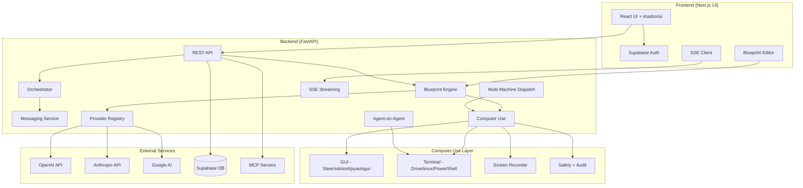

# AgentForge

**Multi-agent AI workflow platform with computer use, cross-platform automation, and visual blueprint orchestration.**

Build custom AI agents that chain LLM calls, automate GUIs, orchestrate terminals, and coordinate across machines. Visual DAG editor with 44 node types, multi-model provider support, and real-time SSE streaming.


---

## Features

### Blueprint System
Visual DAG workflow builder with 44 node types across 9 categories. Drag-and-drop React Flow editor, topological execution engine with concurrent layer resolution, context assembly with token budgets, retry policies, and SSE-streamed execution traces.

### Computer Use (GUI + Terminal Automation)
Agents operate machines through GUI automation and terminal orchestration across macOS, Linux, and Windows:

- **GUI Control (Steer)** — 12 nodes: screenshot, OCR, click, type, hotkey, scroll, drag, focus, find, wait, clipboard, app listing
- **Terminal Control (Drive)** — 6 nodes: session management, command execution, key sending, log capture, polling, parallel fanout
- **CU Agent Nodes** — 4 LLM-powered nodes: Planner, Analyzer, Verifier, Error Handler
- **Safety** — app blocklist, command blocklist, rate limiting (30 actions/min), approval gates, audit logging

### Agent-on-Agent Orchestration
Spawn and control external coding agents (Claude Code, Codex CLI, Gemini CLI, Aider) as workers in tmux sessions. Full lifecycle management: spawn, prompt, monitor, wait, capture, stop. 6 agent control blueprint nodes with 4 pre-configured backends + custom support.

### Multi-Machine Dispatch
Route blueprint nodes to different execution targets. Dispatch routing: explicit target → blueprint default → capability-based → local fallback. REST API for target management with health checks.

### Screen Recording
Capture video of computer use sessions via ffmpeg. Quality presets (720p/1080p/native), recording control blueprint node, CLI management.

### Cross-Platform Support
| Platform | GUI Automation | Terminal | Method |
|----------|---------------|----------|--------|
| macOS | Steer CLI | Drive CLI / tmux | Native CLIs |
| Linux | xdotool, scrot, tesseract, wmctrl, xclip | tmux | System tools + Xvfb |
| Windows | pyautogui, pytesseract, pygetwindow | PowerShell + WSL/tmux | Python packages |

### Multi-Model Providers
Provider registry supporting OpenAI, Anthropic, and Google. Per-node model selection, health monitoring, and model comparison tools.

### Multi-Agent Orchestration
Submit objectives and let agents decompose tasks, respect dependency graphs, and execute concurrently. Roles: coordinator, supervisor, worker, scout, reviewer.

### Knowledge Base + RAG
Document collections with chunked upload, semantic search via cosine similarity, and a `knowledge_retrieval` blueprint node for RAG-augmented workflows.

### Eval Framework
Eval suites with grading methods: exact_match, contains, json_schema, screenshot_match, ocr_contains. Multi-model comparison and per-prompt-version evaluation.

### Human-in-the-Loop
`approval_gate` blueprint node pauses execution for human review. Approve/reject with inbox UI and CLI.

### MCP Integration
Model Context Protocol connection management with unified tool registry. MCP tools available in agents and blueprints.

### Observability
Distributed trace recording for all executions with timeline visualization, trace viewer, and stats API.

### Prompt Versioning
Version management with diff, rollback, and eval integration. Track prompt evolution across blueprint iterations.

### Workflow Marketplace
Publish, browse, fork, and rate blueprints. Organization support with member RBAC (owner/admin/member).

### Live Dashboard
Real-time monitoring with heartbeat tracking, SSE-powered updates, stalled agent detection, event timeline, and cost analytics.

### CLI
Full command-line interface with 20+ command groups: agents, blueprints, orchestrate, costs, cu (computer use), backends, targets, recordings, evals, approvals, traces, prompts, knowledge, marketplace, teams, messages, triggers, mcp, models, and more.

---

## Node Types (44)

| Category | Count | Nodes |
|----------|-------|-------|
| Context | 3 | fetch_url, fetch_document, knowledge_retrieval |
| Transform | 2 | text_splitter, template_renderer |
| Validate | 3 | json_validator, run_linter, approval_gate |
| Output | 2 | output_formatter, chunker |
| Agent (LLM) | 5 | llm_summarize, llm_extract, llm_generate, llm_review, llm_classify |
| GUI (Steer) | 13 | steer_see, steer_ocr, steer_click, steer_type, steer_hotkey, steer_scroll, steer_drag, steer_focus, steer_find, steer_wait, steer_clipboard, steer_apps, recording_control |
| Terminal (Drive) | 6 | drive_session, drive_run, drive_send, drive_logs, drive_poll, drive_fanout |
| CU Agent | 4 | cu_planner, cu_analyzer, cu_verifier, cu_error_handler |
| Agent Control | 6 | agent_spawn, agent_prompt, agent_monitor, agent_wait, agent_stop, agent_result |

---

## Blueprint Templates (13)

| Template | Category | Key Nodes |
|----------|----------|-----------|
| Document Analyzer | Core | fetch_document → text_splitter → llm_extract → json_validator → output_formatter |
| Research Report | Core | 3× fetch_url → text_splitter → llm_summarize → llm_generate → output_formatter |
| Code Review | Core | template_renderer → llm_review → json_validator → output_formatter |
| Data Extraction | Core | fetch_document → text_splitter → llm_extract → json_validator → output_formatter |
| Content Generator | Core | template_renderer → llm_generate → run_linter → llm_generate → output_formatter |
| Browser Research | CU | steer_see → steer_ocr → cu_planner → steer_click → steer_type → steer_ocr |
| Terminal Task Runner | CU | drive_session → drive_run → drive_poll → drive_logs → cu_analyzer |
| Cross-App Workflow | CU | steer_apps → steer_focus → steer_see → cu_planner → steer_click → steer_type |
| Self-Healing Automation | CU | cu_planner → steer_click → cu_verifier → cu_error_handler |
| Multi-Terminal Parallel | CU | drive_session × 3 → drive_fanout → drive_logs → cu_analyzer |
| Agent Inception | Agent | agent_spawn → agent_prompt → agent_monitor → agent_wait → agent_result |
| Parallel Multi-Agent Code Review | Agent | agent_spawn × 3 → agent_prompt → agent_wait → agent_result |
| Universal Browser Automation | Cross-Platform | Platform detection → steer_see → steer_ocr → cu_planner → steer_click |

---

## Architecture



---

## Tech Stack

| Layer | Technology |
|-------|-----------|
| Frontend | Next.js 14, TypeScript, Tailwind CSS, shadcn/ui, React Flow, Bun |
| Backend | Python 3.12, FastAPI, LangChain, OpenAI/Anthropic/Google APIs |
| Computer Use | Steer, Drive, xdotool, pyautogui, ffmpeg, tmux |
| CLI | Typer, Rich, httpx |
| Database | PostgreSQL via Supabase (17 migrations) |
| Auth | Supabase Auth (email + GitHub OAuth) |
| Testing | pytest (515 tests), vitest + testing-library (21 tests) |
| Deployment | Vercel (frontend) + Render (backend) |
| CI/CD | GitHub Actions (ruff, mypy, pytest, ESLint, tsc, vitest) |

---

## Setup

### Prerequisites

- [Bun](https://bun.sh) (frontend)
- Python 3.12+
- Supabase project ([create one](https://supabase.com))
- OpenAI API key (and optionally Anthropic / Google API keys)

### 1. Clone

```bash
git clone https://github.com/AaronCx/AgentForge.git
cd AgentForge
```

### 2. Database

Run the SQL migrations in your Supabase dashboard (SQL Editor), in order:

```
supabase/migrations/001_users.sql
supabase/migrations/002_agents.sql
supabase/migrations/003_runs.sql
supabase/migrations/004_api_keys.sql
supabase/migrations/005_agent_heartbeats.sql
supabase/migrations/006_token_usage.sql
supabase/migrations/007_hierarchy.sql
supabase/migrations/008_agent_messages.sql
supabase/migrations/20260312_blueprints.sql
supabase/migrations/20260312_multi_model.sql
supabase/migrations/20260312_mcp_triggers.sql
supabase/migrations/20260312_eval_hitl.sql
supabase/migrations/20260312_observability_prompts.sql
supabase/migrations/20260312_knowledge_rag.sql
supabase/migrations/20260312_marketplace_teams.sql
supabase/migrations/20260312_computer_use.sql
supabase/migrations/20260312_execution_targets.sql
```

### 3. Backend

```bash
cd backend
python3.12 -m venv .venv
source .venv/bin/activate
pip install -r requirements.txt

cp .env.example .env
# Edit .env with your keys
```

```bash
uvicorn app.main:app --reload
```

### 4. Frontend

```bash
cd frontend
bun install

cp .env.example .env.local
# Edit .env.local with your Supabase keys
```

```bash
bun run dev
```

### 5. CLI (optional)

```bash
cd cli
pip install -e .
agentforge init
```

### 6. Computer Use (optional)

```bash
# macOS
brew install disler/tap/steer disler/tap/drive tmux

# Linux
sudo apt install xdotool scrot tesseract-ocr wmctrl xclip tmux xvfb

# Windows
pip install pyautogui pytesseract pygetwindow pyperclip
```

### 7. Docker

```bash
cp backend/.env.example .env
docker-compose up --build
```

---

## Computer Use Setup (macOS)

```bash
./scripts/bootstrap-macos.sh    # Full setup: installs deps, builds CLIs, checks permissions
./scripts/bootstrap-verify.sh   # Quick verification: smoke tests all Steer & Drive commands
```

---

## Demo Mode

```
http://localhost:3000/dashboard?demo=true
```

---

## Environment Variables

### Backend (`backend/.env`)

| Variable | Description |
|----------|-------------|
| `OPENAI_API_KEY` | OpenAI API key |
| `ANTHROPIC_API_KEY` | Anthropic API key (optional) |
| `GOOGLE_API_KEY` | Google AI API key (optional) |
| `SUPABASE_URL` | Supabase project URL |
| `SUPABASE_SERVICE_KEY` | Supabase service role key |
| `SERPAPI_KEY` | SerpAPI key for web search |
| `FRONTEND_URL` | Frontend URL for CORS |
| `CU_DRY_RUN` | Set `true` for computer use dry-run mode |
| `LISTEN_SERVER_URL` | Remote Listen server URL (optional) |

### Frontend (`frontend/.env.local`)

| Variable | Description |
|----------|-------------|
| `NEXT_PUBLIC_SUPABASE_URL` | Supabase project URL |
| `NEXT_PUBLIC_SUPABASE_ANON_KEY` | Supabase anonymous key |
| `NEXT_PUBLIC_API_URL` | Backend API URL |

---

## API

### Authentication

```
Authorization: Bearer <supabase-access-token>
```

### Core Endpoints

| Method | Path | Description |
|--------|------|-------------|
| `GET` | `/api/agents` | List agents |
| `POST` | `/api/agents` | Create agent |
| `POST` | `/api/agents/:id/run` | Run agent (SSE) |
| `GET` | `/api/blueprints` | List blueprints |
| `POST` | `/api/blueprints` | Create blueprint |
| `POST` | `/api/blueprints/:id/run` | Run blueprint (SSE) |
| `GET` | `/api/blueprints/node-types` | List all 44 node types |
| `GET` | `/api/blueprints/templates` | List blueprint templates |
| `POST` | `/api/orchestrate` | Start orchestration (SSE) |

### Computer Use

| Method | Path | Description |
|--------|------|-------------|
| `GET` | `/api/computer-use/status` | Capability report |
| `GET` | `/api/computer-use/config` | CU configuration |
| `POST` | `/api/computer-use/refresh` | Refresh capability cache |
| `POST` | `/api/computer-use/remote/test` | Test remote connection |
| `GET` | `/api/computer-use/audit-log` | Audit log entries |

### Multi-Machine Dispatch

| Method | Path | Description |
|--------|------|-------------|
| `GET` | `/api/targets` | List execution targets |
| `POST` | `/api/targets` | Register target |
| `DELETE` | `/api/targets/:id` | Remove target |
| `POST` | `/api/targets/:id/health` | Health check target |
| `GET` | `/api/targets/capabilities` | Aggregated capabilities |

### Other APIs

| Group | Endpoints |
|-------|-----------|
| Runs | `GET /api/runs`, `GET /api/runs/:id` |
| Costs | `GET /api/costs/summary`, `/breakdown`, `/projection` |
| Dashboard | `GET /api/dashboard/active`, `/metrics`, `/timeline`, `/stream` |
| Messages | `POST /api/messages`, `GET /api/messages/:group_id` |
| Orchestration | `GET /api/orchestrate/groups`, `GET /api/orchestrate/groups/:id` |
| Providers | `GET /api/providers/models`, `GET /api/providers/health` |
| Evals | `POST /api/evals`, `GET /api/evals`, `POST /api/evals/:id/run` |
| Approvals | `GET /api/approvals`, `POST /api/approvals/:id/approve` |
| Traces | `GET /api/traces`, `GET /api/traces/:id` |
| Prompts | `GET /api/prompts/:id/versions`, `POST /api/prompts/:id/rollback` |
| Knowledge | `GET /api/knowledge/collections`, `POST /api/knowledge/search` |
| Marketplace | `GET /api/marketplace/listings`, `POST /api/marketplace/listings` |
| Organizations | `GET /api/organizations`, `POST /api/organizations` |
| MCP | `GET /api/mcp/connections` |
| Triggers | `GET /api/triggers`, `POST /api/triggers` |
| API Keys | `GET /api/keys`, `POST /api/keys`, `DELETE /api/keys/:id` |

---

## CLI

```bash
agentforge status                           # Server health
agentforge dashboard                        # Live TUI dashboard
agentforge agents list                      # List agents
agentforge agents run <id> --input "..."    # Run agent
agentforge blueprints list                  # List blueprints
agentforge blueprints run <id> --input "..."# Run blueprint
agentforge orchestrate "objective"          # Multi-agent orchestration
agentforge costs --period week              # Cost analytics
agentforge cu status                        # Computer use capabilities
agentforge cu see                           # Take screenshot
agentforge cu ocr                           # OCR screen text
agentforge cu click 500 300                 # Click coordinates
agentforge cu type "hello"                  # Type text
agentforge cu backends list                 # List agent backends
agentforge cu backends test claude-code     # Test backend
agentforge targets list                     # List execution targets
agentforge targets add "server" --url ...   # Add target
agentforge recordings list                  # List recordings
agentforge evals list                       # List eval suites
agentforge traces list                      # List traces
agentforge knowledge list                   # List collections
agentforge marketplace browse               # Browse marketplace
```

---

## Testing

```bash
# Backend (515 tests)
cd backend && source .venv/bin/activate
pytest tests/ -v --cov=app

# Frontend (21 tests)
cd frontend && bun run test
```

---

## Project Structure

```
AgentForge/
├── frontend/                    # Next.js 14 + TypeScript + Tailwind + shadcn/ui
│   ├── app/                     # App Router pages
│   │   ├── dashboard/           # All dashboard pages (15+ routes)
│   │   ├── demo/                # Demo mode redirect
│   │   └── docs/                # Documentation page
│   ├── components/              # UI components
│   │   ├── blueprints/          # NodePalette, BlueprintNode, ConfigPanel
│   │   ├── dashboard/           # MetricsBar, AgentStatusGrid, EventTimeline
│   │   └── ui/                  # shadcn/ui primitives
│   └── lib/                     # API client, Supabase, demo data
├── backend/                     # FastAPI + LangChain
│   ├── app/
│   │   ├── config/              # Computer use, agent backends config
│   │   ├── routers/             # 20+ API route modules
│   │   ├── providers/           # Multi-model provider registry
│   │   ├── services/
│   │   │   ├── blueprint_nodes/ # Node executors + registry (44 types)
│   │   │   ├── computer_use/    # Steer, Drive, agents, dispatch, recorder, platform
│   │   │   │   ├── agents/      # Agent-on-agent runner + nodes
│   │   │   │   ├── linux/       # Linux steer + virtual display
│   │   │   │   ├── steer/       # macOS GUI node executors
│   │   │   │   ├── drive/       # Terminal node executors
│   │   │   │   └── windows/     # Windows steer + drive
│   │   │   └── evals/           # Grading methods
│   │   └── mcp/                 # MCP tool registry + scheduler
│   └── tests/                   # 515 tests (unit, integration, E2E)
├── cli/                         # Typer + Rich CLI (20+ command groups)
├── supabase/migrations/         # 17 SQL migrations with RLS
├── docs/                        # Test reports
├── .github/workflows/           # CI/CD pipeline
└── docker-compose.yml
```

---

## License

MIT
