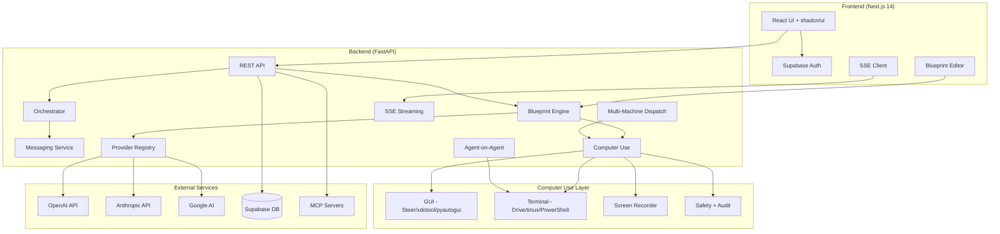

# AgentForge

**Agentic AI orchestration platform — design workflows visually, automate GUIs and terminals, and coordinate agents across machines.**

Build AI-powered workflows that chain LLM reasoning with deterministic logic, automate any desktop or terminal, and orchestrate multiple agents in parallel. Visual DAG editor with 44 node types, cross-platform computer use, multi-model provider support, and real-time execution streaming.


---

## Features

### Visual Blueprint System
Drag-and-drop DAG workflow builder with 44 node types across 9 categories. Topological execution engine with concurrent layer resolution, context assembly with token budgets, retry policies, and SSE-streamed execution traces.

### Computer Use (GUI + Terminal)
Agents operate machines through GUI automation and terminal orchestration across macOS, Linux, and Windows:

| Capability | Nodes | What It Does |
|-----------|-------|-------------|
| **GUI (Steer)** | 12 | Screenshot, OCR, click, type, hotkey, scroll, drag, focus, find, wait, clipboard, app listing |
| **Terminal (Drive)** | 6 | Session management, command execution, key sending, log capture, polling, parallel fanout |
| **CU Agents** | 4 | LLM-powered Planner, Analyzer, Verifier, Error Handler |
| **Screen Recording** | 1 | Record sessions via CoreGraphics + ffmpeg (works over SSH) |
| **Safety** | — | App/command blocklist, rate limiting, approval gates, audit logging |

### Cross-Platform Support

| Platform | GUI Automation | Terminal | Method |
|----------|---------------|----------|--------|
| macOS | Native Steer CLI (CoreGraphics, cliclick, Vision OCR) | Drive CLI / tmux | Works over SSH |
| Linux | xdotool, scrot, tesseract, wmctrl, xclip | tmux | Xvfb for headless |
| Windows | pyautogui, pytesseract, pygetwindow | PowerShell + WSL/tmux | Python packages |

### Agent-on-Agent Orchestration
Spawn and control external coding agents (Claude Code, Codex CLI, Gemini CLI, Aider) as workers in tmux sessions. Full lifecycle management with 6 agent control blueprint nodes.

### Multi-Machine Dispatch
Route blueprint nodes to different execution targets. Dispatch routing: explicit target → blueprint default → capability-based → local fallback.

### Multi-Model Providers
Provider registry supporting OpenAI, Anthropic, and Google. Per-node model selection, health monitoring, and comparison tools.

### Knowledge Base + RAG
Document collections with chunked upload, semantic search, and a `knowledge_retrieval` blueprint node for RAG-augmented workflows.

### Eval Framework
Test agent outputs with grading methods: exact_match, contains, json_schema, screenshot_match, ocr_contains. Multi-model comparison and per-prompt-version evaluation.

### Human-in-the-Loop
`approval_gate` blueprint node pauses execution for human review. Approve/reject with inbox UI and CLI.

### MCP Integration
Model Context Protocol connection management. Agents dynamically discover and use tools from connected MCP servers.

### Observability + Prompt Versioning
Distributed trace recording for all executions. Version prompts like code — diff, rollback, and measure how changes affect output quality.

### Workflow Marketplace
Publish, browse, fork, and rate blueprints. Organization support with member RBAC.

### Live Dashboard + CLI
Real-time monitoring with heartbeat tracking, SSE-powered updates, cost analytics. Full CLI with 20+ command groups.

---

## Node Types (44)

| Category | Count | Nodes |
|----------|-------|-------|
| Context | 3 | fetch_url, fetch_document, knowledge_retrieval |
| Transform | 2 | text_splitter, template_renderer |
| Validate | 3 | json_validator, run_linter, approval_gate |
| Output | 2 | output_formatter, chunker |
| Agent (LLM) | 5 | llm_summarize, llm_extract, llm_generate, llm_review, llm_classify |
| GUI (Steer) | 13 | steer_see, steer_ocr, steer_click, steer_type, steer_hotkey, steer_scroll, steer_drag, steer_focus, steer_find, steer_wait, steer_clipboard, steer_apps, recording_control |
| Terminal (Drive) | 6 | drive_session, drive_run, drive_send, drive_logs, drive_poll, drive_fanout |
| CU Agent | 4 | cu_planner, cu_analyzer, cu_verifier, cu_error_handler |
| Agent Control | 6 | agent_spawn, agent_prompt, agent_monitor, agent_wait, agent_stop, agent_result |

---

## Architecture



---

## Tech Stack

| Layer | Technology |
|-------|-----------|
| Frontend | Next.js 14, TypeScript, Tailwind CSS, shadcn/ui, React Flow, Bun |
| Backend | Python 3.12, FastAPI, LangChain, OpenAI/Anthropic/Google APIs |
| Computer Use | CoreGraphics, cliclick, Vision OCR, ffmpeg, tmux, xdotool, pyautogui |
| CLI | Typer, Rich, httpx |
| Database | PostgreSQL via Supabase (17 migrations with RLS) |
| Auth | Supabase Auth (email + GitHub OAuth) |
| Testing | pytest (515 tests), vitest + testing-library (21 tests) |
| Deployment | Vercel (frontend), Render (backend) |
| CI/CD | GitHub Actions (Ruff, mypy, pytest, ESLint, tsc, vitest) |

---

## Quick Start

```bash
# Clone and setup
git clone https://github.com/AaronCx/AgentForge.git
cd AgentForge
./setup.sh

# Add your API keys
edit backend/.env              # Add OpenAI/Anthropic/Supabase keys
edit frontend/.env.local       # Add Supabase keys

# Start everything
agentforge up

# Open the dashboard
agentforge dashboard           # Terminal TUI
# or visit http://localhost:3000  # Web GUI
```

That's the entire quick start. Four visible steps.

### Prerequisites

- Python 3.11+ (backend + CLI)
- [Bun](https://bun.sh) or Node.js (frontend)
- [Supabase](https://supabase.com) project (database + auth)
- OpenAI API key (optionally Anthropic / Google)

### Database Migrations

`setup.sh` generates a combined migration file at `supabase/migrations/combined_all.sql`. Paste it into your Supabase SQL Editor, or use the Supabase CLI:

```bash
npx supabase db push
```

### Computer Use (macOS)

```bash
./scripts/bootstrap-macos.sh      # Installs deps, builds native CLIs, checks permissions
./scripts/bootstrap-verify.sh     # Smoke tests all 20 Steer + Drive commands
```

<details>
<summary>Linux / Windows setup</summary>

```bash
# Linux
sudo apt install xdotool scrot tesseract-ocr wmctrl xclip tmux xvfb

# Windows
pip install pyautogui pytesseract pygetwindow pyperclip
```

</details>

### Docker

```bash
cp backend/.env.example .env
docker-compose up --build
```

### Stack Management

```bash
agentforge up          # Start backend + frontend
agentforge down        # Stop everything
agentforge restart     # Restart all services
agentforge status      # Quick health check
agentforge dashboard   # Live TUI monitor
```

---

## Environment Variables

### Backend (`backend/.env`)

| Variable | Description |
|----------|-------------|
| `OPENAI_API_KEY` | OpenAI API key |
| `ANTHROPIC_API_KEY` | Anthropic API key (optional) |
| `GOOGLE_API_KEY` | Google AI API key (optional) |
| `SUPABASE_URL` | Supabase project URL |
| `SUPABASE_SERVICE_KEY` | Supabase service role key |
| `SERPAPI_KEY` | SerpAPI key for web search (optional) |
| `FRONTEND_URL` | Frontend URL for CORS |
| `CU_DRY_RUN` | `true` for computer use dry-run mode |

### Frontend (`frontend/.env.local`)

| Variable | Description |
|----------|-------------|
| `NEXT_PUBLIC_SUPABASE_URL` | Supabase project URL |
| `NEXT_PUBLIC_SUPABASE_ANON_KEY` | Supabase anonymous key |
| `NEXT_PUBLIC_API_URL` | Backend API URL |

---

## API

### Authentication

```
Authorization: Bearer <supabase-access-token>
```

### Core

| Method | Path | Description |
|--------|------|-------------|
| `GET` | `/api/agents` | List agents |
| `POST` | `/api/agents` | Create agent |
| `POST` | `/api/agents/:id/run` | Run agent (SSE) |
| `GET` | `/api/blueprints` | List blueprints |
| `POST` | `/api/blueprints` | Create blueprint |
| `POST` | `/api/blueprints/:id/run` | Run blueprint (SSE) |
| `GET` | `/api/blueprints/node-types` | List all 44 node types |
| `POST` | `/api/orchestrate` | Start orchestration (SSE) |

### Computer Use

| Method | Path | Description |
|--------|------|-------------|
| `GET` | `/api/computer-use/status` | Capability report |
| `GET` | `/api/computer-use/config` | Configuration |
| `POST` | `/api/computer-use/refresh` | Refresh capabilities |
| `GET` | `/api/computer-use/audit-log` | Audit log |

### Additional APIs

Runs, Costs, Dashboard, Messages, Orchestration, Providers, Evals, Approvals, Traces, Prompts, Knowledge, Marketplace, Organizations, MCP, Triggers, Targets, API Keys

---

## CLI

```bash
agentforge status                           # Server health
agentforge dashboard                        # Live TUI dashboard
agentforge agents list                      # List agents
agentforge agents run <id> --input "..."    # Run agent
agentforge blueprints list                  # List blueprints
agentforge blueprints run <id> --input "..."# Run blueprint
agentforge orchestrate "objective"          # Multi-agent orchestration
agentforge costs --period week              # Cost analytics
agentforge cu status                        # Computer use capabilities
agentforge cu see                           # Take screenshot
agentforge cu ocr                           # OCR screen text
agentforge cu click 500 300                 # Click at coordinates
agentforge cu type "hello"                  # Type text
agentforge cu backends list                 # List agent backends
agentforge targets list                     # List execution targets
agentforge recordings list                  # List screen recordings
agentforge evals list                       # List eval suites
agentforge traces list                      # List execution traces
agentforge knowledge list                   # List document collections
agentforge marketplace browse               # Browse workflow marketplace
```

---

## Testing

```bash
# Backend (515 tests)
cd backend && source .venv/bin/activate
pytest tests/ -v --cov=app

# Frontend (21 tests)
cd frontend && bun run test
```

---

## Project Structure

```
AgentForge/
├── frontend/                    # Next.js 14 + TypeScript + Tailwind + shadcn/ui
│   ├── app/dashboard/           # 15+ dashboard routes
│   ├── components/              # Blueprint editor, dashboard, UI primitives
│   └── lib/                     # API client, Supabase, demo data
├── backend/                     # FastAPI + LangChain
│   ├── app/
│   │   ├── routers/             # 20+ API route modules
│   │   ├── providers/           # Multi-model provider registry
│   │   └── services/
│   │       ├── blueprint_nodes/ # 44 node type executors
│   │       └── computer_use/    # Steer, Drive, agents, dispatch, recorder
│   │           ├── steer/       # macOS GUI automation
│   │           ├── drive/       # Terminal automation
│   │           ├── linux/       # xdotool/tesseract fallback
│   │           └── windows/     # pyautogui/PowerShell fallback
│   └── tests/                   # 515 tests
├── cli/                         # Typer + Rich CLI
├── scripts/                     # Bootstrap, Steer/Drive CLIs, OCR helper
├── supabase/migrations/         # 17 SQL migrations with RLS
├── docs/                        # Test & security reports
└── .github/workflows/           # CI + deployment
```

---

## License

MIT
